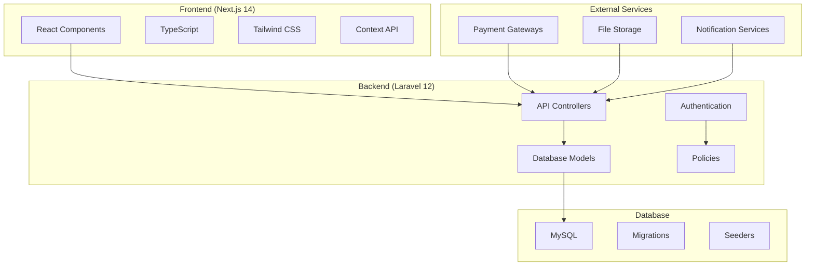
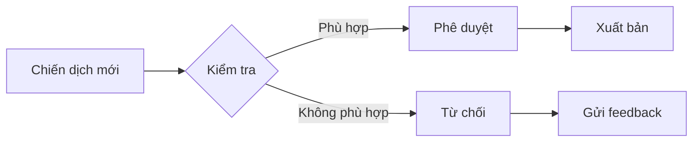

# 🤝 KV Together - Nền tảng Gây quỹ Từ thiện

[](https://opensource.org/licenses/MIT)
[](https://nextjs.org/)
[](https://laravel.com)
[](https://www.typescriptlang.org/)
[](https://tailwindcss.com/)

> **Kết nối trái tim - Chia sẻ yêu thương** 💖

KV Together là một nền tảng gây quỹ từ thiện hiện đại, giúp kết nối những người có tấm lòng với các dự án cần hỗ trợ. Từ các chiến dịch y tế, giáo dục, đến hỗ trợ cộng đồng - chúng tôi tạo ra một không gian minh bạch và đáng tin cậy cho hoạt động từ thiện.

---

## 📖 Mục lục

- [🎯 Tính năng chính](#-tính-năng-chính)
- [🏗️ Kiến trúc hệ thống](#️-kiến-trúc-hệ-thống)
- [🚀 Bắt đầu nhanh](#-bắt-đầu-nhanh)
- [📋 Yêu cầu hệ thống](#-yêu cầu-hệ-thống)
- [⚙️ Cài đặt](#️-cài-đặt)
- [🔧 Cấu hình](#-cấu-hình)
- [📱 Sử dụng](#-sử-dụng)
- [🎨 Demo & Screenshots](#-demo--screenshots)
- [📚 API Documentation](#-api-documentation)
- [🧪 Testing](#-testing)
- [🚀 Deployment](#-deployment)
- [🤝 Đóng góp](#-đóng-góp)
- [📄 License](#-license)
- [👥 Nhóm phát triển](#-nhóm-phát-triển)

---

## 🎯 Tính năng chính

### 🌟 Dành cho Người dùng
- ✅ **Khám phá chiến dịch**: Duyệt và tìm kiếm các chiến dịch theo danh mục
- ✅ **Quyên góp dễ dàng**: Hỗ trợ nhiều phương thức thanh toán (MoMo, VNPay, Chuyển khoản)
- ✅ **Theo dõi tiến độ**: Xem tiến độ real-time của các chiến dịch
- ✅ **Tương tác cộng đồng**: Để lại lời nhắn và chia sẻ chiến dịch
- ✅ **Chứng nhận quyên góp**: Nhận chứng nhận điện tử sau khi quyên góp

### 🎯 Dành cho Fundraiser
- ✅ **Tạo chiến dịch**: Công cụ tạo chiến dịch với editor WYSIWYG
- ✅ **Quản lý chiến dịch**: Dashboard theo dõi tiến độ và quyên góp
- ✅ **Phân tích chi tiết**: Báo cáo thống kê và phân tích hiệu quả
- ✅ **Cập nhật tiến độ**: Đăng updates và hình ảnh cho supporters
- ✅ **Quản lý profile**: Xây dựng thông tin tổ chức đáng tin cậy

### 🛡️ Dành cho Admin
- ✅ **Kiểm duyệt chiến dịch**: Phê duyệt/từ chối chiến dịch
- ✅ **Quản lý người dùng**: Phân quyền và quản lý tài khoản
- ✅ **Dashboard phân tích**: Thống kê tổng quan hệ thống
- ✅ **Quản lý thanh toán**: Theo dõi và xác thực các giao dịch
- ✅ **Báo cáo hệ thống**: Export dữ liệu và báo cáo định kỳ

---

## 🏗️ Kiến trúc hệ thống



### 📂 Cấu trúc dự án

```
KV_Together/
├── 🎨 frontend/          # Next.js Application
│   ├── src/
│   │   ├── app/          # App Router (Next.js 13+)
│   │   ├── components/   # React Components
│   │   ├── contexts/     # React Contexts
│   │   ├── services/     # API Services
│   │   ├── types/        # TypeScript Types
│   │   └── utils/        # Utility Functions
│   └── public/           # Static Assets
├── ⚡ backend/           # Laravel API
│   ├── app/
│   │   ├── Http/Controllers/  # API Controllers
│   │   ├── Models/       # Eloquent Models
│   │   ├── Policies/     # Authorization Policies
│   │   └── Services/     # Business Logic
│   ├── database/
│   │   ├── migrations/   # Database Migrations
│   │   └── seeders/      # Data Seeders
│   └── routes/           # API Routes
└── 📊 data/             # Sample Data
    ├── children/         # Chiến dịch trẻ em
    ├── medical/          # Chiến dịch y tế
    ├── education/        # Chiến dịch giáo dục
    └── community/        # Chiến dịch cộng đồng
```

---

## 🚀 Bắt đầu nhanh

### 🎬 Video hướng dẫn
> *Đang cập nhật...*

### ⚡ Quick Start (5 phút)

```bash
# 1. Clone repository
git clone https://github.com/Vudangkhoa0910/KV_Together.git
cd KV_Together

# 2. Cài đặt dependencies
npm install                    # Root dependencies
cd backend && composer install # Laravel dependencies
cd ../frontend && npm install  # Next.js dependencies

# 3. Cấu hình môi trường
cp backend/.env.example backend/.env
cp frontend/.env.example frontend/.env.local

# 4. Thiết lập database
cd backend
php artisan key:generate
php artisan migrate:fresh --seed

# 5. Khởi động development server
npm run dev  # Từ root directory
```

🎉 **Hoàn thành!** Truy cập:
- Frontend: http://localhost:3000
- Backend API: http://localhost:8000
- Admin Panel: http://localhost:3000/admin

---

## 📋 Yêu cầu hệ thống

### 🖥️ Development Environment

| Component | Phiên bản | Ghi chú |
|-----------|-----------|---------|
| **Node.js** | ≥ 18.0.0 | Khuyến nghị LTS |
| **PHP** | ≥ 8.2 | Với extensions: mysql, gd, curl |
| **Composer** | ≥ 2.0 | PHP dependency manager |
| **MySQL** | ≥ 8.0 | Hoặc MariaDB ≥ 10.3 |
| **npm/yarn** | Latest | Package manager |

### 🌐 Production Environment

| Component | Khuyến nghị | Tối thiểu |
|-----------|-------------|-----------|
| **RAM** | 2GB+ | 1GB |
| **Storage** | 10GB+ | 5GB |
| **CPU** | 2 cores+ | 1 core |
| **Bandwidth** | 100Mbps+ | 10Mbps |

---

## ⚙️ Cài đặt

### 🔧 Cài đặt chi tiết

#### 1️⃣ Cài đặt Backend (Laravel)

```bash
cd backend

# Cài đặt dependencies
composer install

# Tạo file môi trường
cp .env.example .env

# Sinh key ứng dụng
php artisan key:generate

# Cấu hình database trong .env
DB_CONNECTION=mysql
DB_HOST=127.0.0.1
DB_PORT=3306
DB_DATABASE=kv_together
DB_USERNAME=root
DB_PASSWORD=

# Chạy migrations và seeders
php artisan migrate:fresh --seed

# Khởi động server
php artisan serve
```

#### 2️⃣ Cài đặt Frontend (Next.js)

```bash
cd frontend

# Cài đặt dependencies
npm install

# Cấu hình môi trường
cp .env.example .env.local

# Cấu hình API URL trong .env.local
NEXT_PUBLIC_API_URL=http://localhost:8000
NEXT_PUBLIC_FRONTEND_URL=http://localhost:3000

# Khởi động development server
npm run dev
```

#### 3️⃣ Cài đặt Root Scripts

```bash
# Từ thư mục root
npm install

# Scripts có sẵn:
npm run dev           # Khởi động cả frontend và backend
npm run build         # Build cho production
npm run start         # Khởi động production server
```

---

## 🔧 Cấu hình

### 🌍 Environment Variables

#### Backend (.env)
```env
# Application
APP_NAME="KV Together"
APP_ENV=local
APP_KEY=base64:generated_key
APP_DEBUG=true
APP_URL=http://localhost:8000

# Database
DB_CONNECTION=mysql
DB_HOST=127.0.0.1
DB_PORT=3306
DB_DATABASE=kv_together
DB_USERNAME=root
DB_PASSWORD=

# Authentication
SANCTUM_STATEFUL_DOMAINS=localhost:3000
SESSION_DOMAIN=localhost

# File Storage
FILESYSTEM_DISK=public

# Mail (Optional)
MAIL_MAILER=smtp
MAIL_HOST=smtp.gmail.com
MAIL_PORT=587
MAIL_USERNAME=your-email@gmail.com
MAIL_PASSWORD=your-app-password

# Payment Gateways (Optional)
MOMO_PARTNER_CODE=your_momo_partner_code
VNPAY_TMN_CODE=your_vnpay_code
```

#### Frontend (.env.local)
```env
# API Configuration
NEXT_PUBLIC_API_URL=http://localhost:8000
NEXT_PUBLIC_FRONTEND_URL=http://localhost:3000

# External Services
NEXT_PUBLIC_GOOGLE_ANALYTICS_ID=GA_MEASUREMENT_ID
```

### 🎨 Tuỳ chỉnh giao diện

#### Tailwind Configuration
```javascript
// frontend/tailwind.config.js
module.exports = {
  theme: {
    extend: {
      colors: {
        primary: '#f97316',    // Orange chủ đạo
        secondary: '#0ea5e9',  // Blue phụ
        accent: '#10b981',     // Green accent
      },
      fontFamily: {
        'sans': ['Inter', 'system-ui', 'sans-serif'],
      }
    }
  }
}
```

---

## 📱 Sử dụng

### 👤 Hướng dẫn cho Người dùng

#### 🔍 Khám phá chiến dịch
1. **Truy cập trang chủ**: Xem các chiến dịch nổi bật
2. **Duyệt theo danh mục**: Trẻ em, Y tế, Giáo dục, Cộng đồng, v.v.
3. **Tìm kiếm**: Sử dụng thanh tìm kiếm hoặc bộ lọc
4. **Xem chi tiết**: Click vào chiến dịch để xem thông tin đầy đủ

#### 💳 Quyên góp
```typescript
// Quy trình quyên góp
1. Chọn số tiền → 2. Để lại lời nhắn → 3. Chọn phương thức thanh toán → 4. Xác nhận
```

**Phương thức thanh toán được hỗ trợ:**
- 🏦 **Chuyển khoản ngân hàng**: QR Code tự động
- 📱 **MoMo**: Ví điện tử phổ biến
- 💳 **VNPay**: Cổng thanh toán đa dạng

#### 📊 Theo dõi quyên góp
- Xem lịch sử quyên góp trong tài khoản
- Nhận chứng nhận quyên góp
- Theo dõi tiến độ các chiến dịch đã ủng hộ

### 🎯 Hướng dẫn cho Fundraiser

#### 📝 Tạo chiến dịch
```bash
1. Đăng ký tài khoản Fundraiser
2. Chờ admin phê duyệt
3. Tạo chiến dịch mới với thông tin đầy đủ:
   - Tiêu đề và mô tả hấp dẫn
   - Hình ảnh và video minh hoạ
   - Mục tiêu quyên góp và thời hạn
   - Thông tin tổ chức/cá nhân
```

#### 📈 Quản lý chiến dịch
- **Dashboard**: Theo dõi tiến độ real-time
- **Analytics**: Xem báo cáo chi tiết
- **Updates**: Đăng tin tức cập nhật
- **Donors**: Quản lý danh sách người quyên góp

#### 🏆 Best Practices
```markdown
✅ Đặt mục tiêu thực tế và rõ ràng
✅ Cập nhật tiến độ thường xuyên
✅ Sử dụng hình ảnh chất lượng cao
✅ Viết mô tả súc tích và cảm động
✅ Tương tác với supporters
```

### 🛡️ Hướng dẫn cho Admin

#### 👮 Quản lý hệ thống
- **Dashboard**: Tổng quan toàn hệ thống
- **Campaigns**: Kiểm duyệt và phê duyệt
- **Users**: Quản lý tài khoản và phân quyền
- **Analytics**: Báo cáo và thống kê

#### 🔍 Quy trình kiểm duyệt


---

## 🎨 Demo & Screenshots

### 🖼️ Giao diện chính

#### 🏠 Trang chủ
```
┌─────────────────────────────────────────┐
│  🌟 KV Together - Nơi kết nối yêu thương │
│                                         │
│  📊 Thống kê:                          │
│  • 150+ chiến dịch hoạt động           │
│  • 5,000+ người đóng góp               │
│  • 2.5 tỷ VNĐ đã quyên góp            │
│                                         │
│  🔥 Chiến dịch nổi bật                 │
│  [Card 1] [Card 2] [Card 3]            │
└─────────────────────────────────────────┘
```

#### 💸 Trang quyên góp
```
┌─────────────────────────────────────────┐
│  🎯 [Tên chiến dịch]                   │
│  ├── 📈 Tiến độ: 75% (750M/1B VNĐ)     │
│  ├── ⏰ Còn: 15 ngày                   │
│  └── 👥 1,234 người ủng hộ             │
│                                         │
│  💰 Chọn số tiền quyên góp:            │
│  [100K] [200K] [500K] [1M] [Tự nhập]   │
│                                         │
│  💳 Phương thức:                       │
│  ○ Chuyển khoản  ○ MoMo  ○ VNPay       │
│                                         │
│  📝 Lời nhắn: [________________]        │
│                                         │
│  [🎁 QUYÊN GÓP NGAY]                   │
└─────────────────────────────────────────┘
```

### 📱 Mobile Responsive
- ✅ Giao diện responsive 100%
- ✅ Touch-friendly trên mobile
- ✅ PWA support (sắp có)

---

## 📚 API Documentation

### 🔗 Base URL
```
Development: http://localhost:8000/api
Production: https://kvtogether.com/api
```

### 🔐 Authentication
```bash
# Login
POST /auth/login
{
  "email": "user@example.com",
  "password": "password"
}

# Response
{
  "access_token": "token_string",
  "user": { /* user object */ }
}
```

### 📋 Campaigns API

#### Lấy danh sách chiến dịch
```bash
GET /campaigns?page=1&category=medical&search=keyword
```

```json
{
  "data": [
    {
      "id": 1,
      "title": "Hỗ trợ điều trị cho bé Minh",
      "slug": "ho-tro-dieu-tri-cho-be-minh",
      "description": "Bé Minh đang cần sự giúp đỡ...",
      "target_amount": 100000000,
      "current_amount": 75000000,
      "progress_percentage": 75,
      "status": "active",
      "organizer": {
        "name": "Quỹ Từ thiện ABC",
        "avatar_url": "https://..."
      },
      "categories": [
        {"id": 1, "name": "Y tế", "slug": "y-te"}
      ],
      "image_url": "https://...",
      "created_at": "2024-01-01T00:00:00.000000Z"
    }
  ],
  "meta": {
    "current_page": 1,
    "last_page": 10,
    "total": 95
  }
}
```

#### Tạo quyên góp
```bash
POST /donations/{campaign_id}
Authorization: Bearer {token}
{
  "amount": 100000,
  "message": "Chúc bé sớm khỏe mạnh!",
  "payment_method": "bank_transfer",
  "is_anonymous": false
}
```

### 📊 Stats API
```bash
GET /stats
```

```json
{
  "total_campaigns": 150,
  "total_donors": 5000,
  "total_amount_raised": 2500000000,
  "active_campaigns": 85
}
```

### 📖 Xem đầy đủ API docs
> Truy cập: http://localhost:8000/api/documentation (sắp có)

---

## 🧪 Testing

### 🔬 Test Suite

```bash
# Backend Testing (Laravel)
cd backend
php artisan test
php artisan test --coverage

# Frontend Testing (Jest + React Testing Library)
cd frontend
npm test
npm run test:coverage
npm run test:watch
```

### 📊 Test Coverage
```
┌─────────────────┬─────────┬─────────┬─────────┬─────────┐
│ File            │ % Stmts │ % Branch│ % Funcs │ % Lines │
├─────────────────┼─────────┼─────────┼─────────┼─────────┤
│ All files       │   85.2  │   78.4  │   90.1  │   84.8  │
│ Components      │   92.3  │   85.1  │   95.2  │   91.7  │
│ Services        │   78.9  │   72.4  │   84.6  │   77.2  │
│ Utils           │   95.6  │   89.2  │   97.8  │   94.1  │
└─────────────────┴─────────┴─────────┴─────────┴─────────┘
```

### 🎯 Test Types
- **Unit Tests**: Components, Services, Utils
- **Integration Tests**: API Endpoints
- **E2E Tests**: Critical User Flows
- **Performance Tests**: Load & Stress Testing

---

## 🚀 Deployment

### 🌐 Production Deployment

#### 📦 Build Process
```bash
# Frontend Build
cd frontend
npm run build
npm start

# Backend Optimization
cd backend
composer install --optimize-autoloader --no-dev
php artisan config:cache
php artisan route:cache
php artisan view:cache
```

#### 🐳 Docker Deployment
```yaml
# docker-compose.yml
version: '3.8'
services:
  frontend:
    build: ./frontend
    ports:
      - "3000:3000"
    environment:
      - NEXT_PUBLIC_API_URL=http://backend:8000
  
  backend:
    build: ./backend
    ports:
      - "8000:8000"
    environment:
      - DB_HOST=database
    depends_on:
      - database
  
  database:
    image: mysql:8.0
    environment:
      MYSQL_DATABASE: kv_together
      MYSQL_ROOT_PASSWORD: password
```

```bash
# Deploy với Docker
docker-compose up -d
```

#### ☁️ Cloud Deployment Options

| Platform | Frontend | Backend | Database |
|----------|----------|---------|----------|
| **Vercel + Railway** | Vercel | Railway | Railway MySQL |
| **AWS** | S3 + CloudFront | EC2 + Load Balancer | RDS MySQL |
| **DigitalOcean** | App Platform | Droplet | Managed Database |

### 🔧 Environment Configs

#### Production Settings
```env
# Backend Production
APP_ENV=production
APP_DEBUG=false
LOG_LEVEL=error

# Frontend Production
NODE_ENV=production
NEXT_PUBLIC_API_URL=https://api.kvtogether.com
```

---

## 🤝 Đóng góp

Chúng tôi hoan nghênh mọi đóng góp từ cộng đồng! 🎉

### 🛠️ Cách đóng góp

#### 1️⃣ Báo cáo lỗi (Bug Reports)
```markdown
🐛 **Mô tả lỗi**: Mô tả ngắn gọn về lỗi
📍 **Tái hiện**: Các bước để tái hiện lỗi
💻 **Môi trường**: Browser, OS, Device
📸 **Screenshots**: Nếu có
```

#### 2️⃣ Đề xuất tính năng (Feature Requests)
```markdown
💡 **Tính năng**: Mô tả tính năng mong muốn
🎯 **Mục đích**: Tại sao tính năng này hữu ích
📋 **Chi tiết**: Mô tả chi tiết cách hoạt động
```

#### 3️⃣ Code Contribution
```bash
# 1. Fork repository
git clone https://github.com/YOUR_USERNAME/KV_Together.git

# 2. Tạo branch mới
git checkout -b feature/amazing-feature

# 3. Commit changes
git commit -m "feat: add amazing feature"

# 4. Push to branch
git push origin feature/amazing-feature

# 5. Tạo Pull Request
```

### 📏 Coding Standards

#### Frontend (TypeScript/React)
```typescript
// ✅ Good
interface CampaignProps {
  campaign: Campaign;
  onDonate: (amount: number) => void;
}

const CampaignCard: React.FC<CampaignProps> = ({ campaign, onDonate }) => {
  // Component logic
};

export default CampaignCard;
```

#### Backend (PHP/Laravel)
```php
// ✅ Good
class CampaignController extends Controller
{
    public function store(CreateCampaignRequest $request): JsonResponse
    {
        $campaign = Campaign::create($request->validated());
        
        return response()->json([
            'message' => 'Campaign created successfully',
            'data' => $campaign
        ], 201);
    }
}
```

### 🏷️ Commit Convention
```
feat: thêm tính năng mới
fix: sửa lỗi
docs: cập nhật documentation
style: format code
refactor: cải thiện code
test: thêm tests
chore: cập nhật config/deps
```

---

## 📄 License

Dự án KV Together được phát hành dưới **MIT License**.

```
MIT License

Copyright (c) 2024 KV Together Team

Permission is hereby granted, free of charge, to any person obtaining a copy
of this software and associated documentation files (the "Software"), to deal
in the Software without restriction, including without limitation the rights
to use, copy, modify, merge, publish, distribute, sublicense, and/or sell
copies of the Software, and to permit persons to whom the Software is
furnished to do so, subject to the following conditions:

The above copyright notice and this permission notice shall be included in all
copies or substantial portions of the Software.

THE SOFTWARE IS PROVIDED "AS IS", WITHOUT WARRANTY OF ANY KIND, EXPRESS OR
IMPLIED, INCLUDING BUT NOT LIMITED TO THE WARRANTIES OF MERCHANTABILITY,
FITNESS FOR A PARTICULAR PURPOSE AND NONINFRINGEMENT. IN NO EVENT SHALL THE
AUTHORS OR COPYRIGHT HOLDERS BE LIABLE FOR ANY CLAIM, DAMAGES OR OTHER
LIABILITY, WHETHER IN AN ACTION OF CONTRACT, TORT OR OTHERWISE, ARISING FROM,
OUT OF OR IN CONNECTION WITH THE SOFTWARE OR THE USE OR OTHER DEALINGS IN THE
SOFTWARE.
```

---

## 👥 Nhóm phát triển

### 🎯 Core Team

<table>
  <tr>
    <td align="center">
      <br />
      <sub><b>Vũ Đăng Khoa</b></sub><br />
      <sub>Full Stack Developer</sub><br />
      <a href="https://github.com/Vudangkhoa0910">💻</a>
      <a href="mailto:vudangkhoa0910@gmail.com">📧</a>
    </td>
    <td align="center">
      <br />
      <sub><b>Vinh</b></sub><br />
      <sub>Data & Content</sub><br />
      <a href="#">💾</a>
      <a href="#">📧</a>
    </td>
  </tr>
</table>

### 🙏 Đóng góp đặc biệt
- **UI/UX Design**: Inspired by modern charity platforms
- **Sample Data**: Realistic Vietnamese charity scenarios
- **Testing**: Community feedback and bug reports
- **Documentation**: Community contributions

### 📞 Liên hệ

- 🌐 **Website**: [https://kvtogether.com](https://kvtogether.com)
- 📧 **Email**: contact@kvtogether.com
- 💬 **Discord**: [KV Together Community](https://discord.gg/kvtogether)
- 📱 **Facebook**: [@KVTogetherOfficial](https://facebook.com/KVTogetherOfficial)

---

## 🎉 Cảm ơn

Cảm ơn bạn đã quan tâm đến dự án **KV Together**! 

Nếu dự án này hữu ích với bạn, đừng quên:
- ⭐ **Star** repository này
- 🐛 **Báo cáo** bugs nếu gặp phải
- 💡 **Đề xuất** tính năng mới
- 🤝 **Share** với bạn bè và đồng nghiệp

> **"Những giọt nước nhỏ tạo nên đại dương. Mỗi đóng góp của bạn đều có ý nghĩa!"** 💖

---

<div align="center">

**Made with ❤️ by KV Together Team**

[](https://github.com/Vudangkhoa0910/KV_Together/stargazers)
[](https://github.com/Vudangkhoa0910/KV_Together/network/members)
[](https://github.com/Vudangkhoa0910/KV_Together/issues)

[⬆️ Về đầu trang](#-kv-together---nền-tảng-gây-quỹ-từ-thiện)

</div>